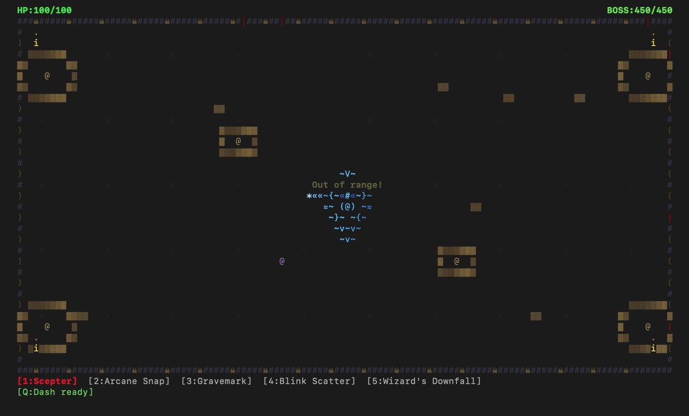

# Tillymagic (macOS)
_the time passing terminal game you never knew you needed!_

:warning: flash warning :warning:



and many more classes, bosses, and maps! the point is _you_ choose your _own_ path.

to play, run:
```
# clone repo
git clone https://github.com/opticalrefraction/tillymagic.git

# open directory
cd tillymagic

# run main script
python3 tillymagic2.py
```
like the game? leave a star! :star:
## extra notes
any recommendations or bug reports can go to the issues tab. please tag them appropriately when doing so!

this repository will be updated frequently--I will plan on integrating an update checker in code. 

fixing soon: appears as 1 or 2 maps are bugged. will fix in next update as I attempt to resolve it.
